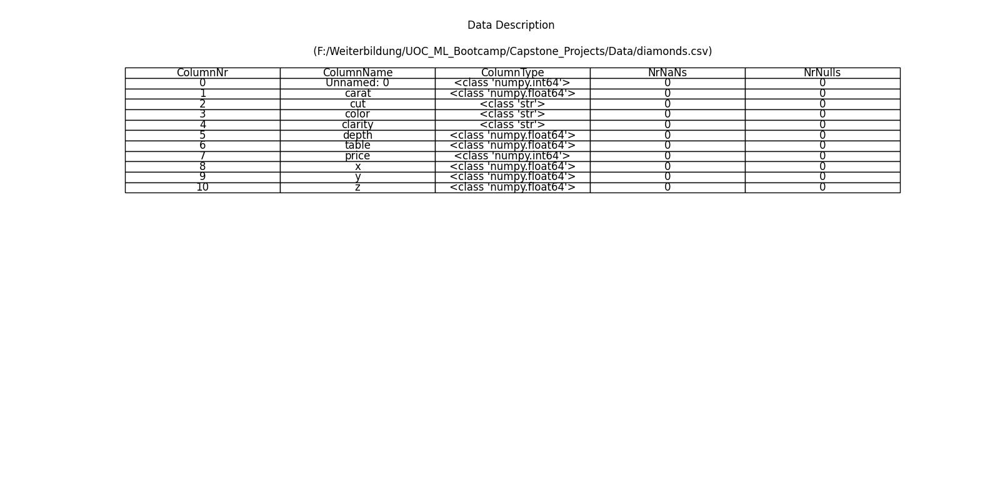
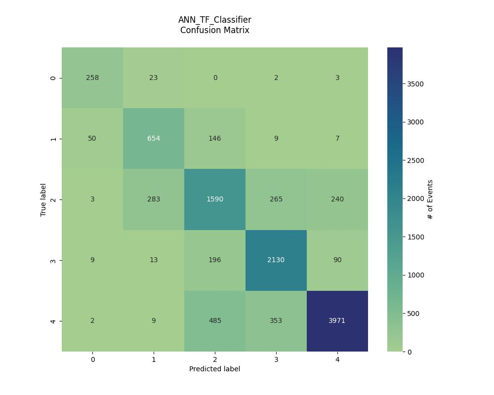
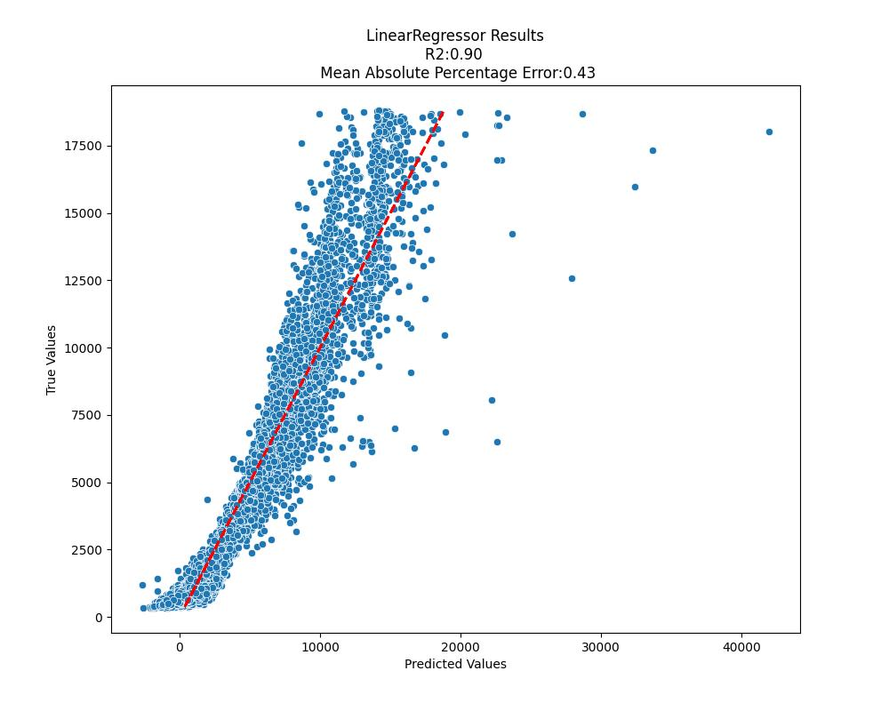
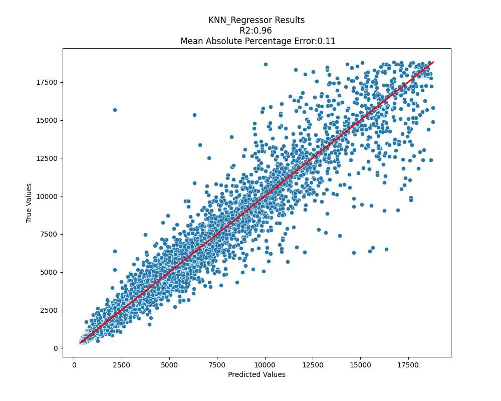
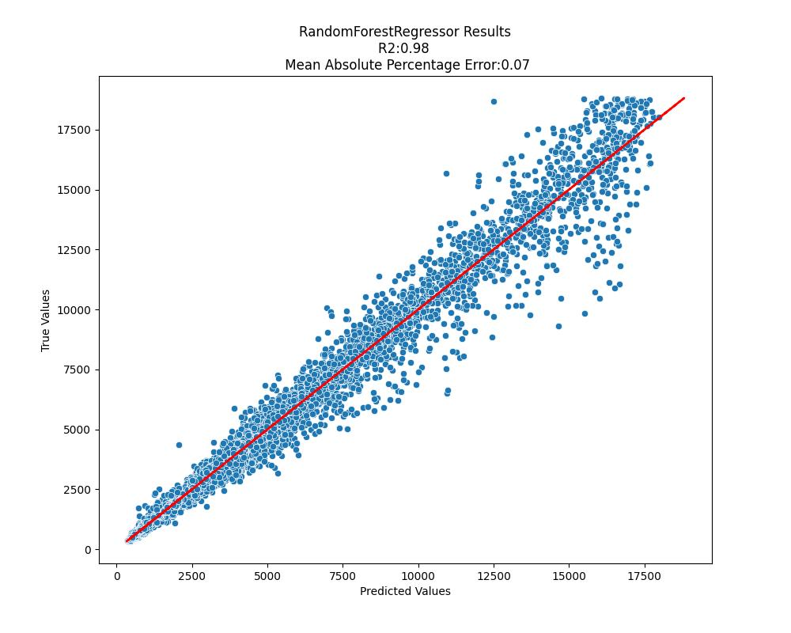
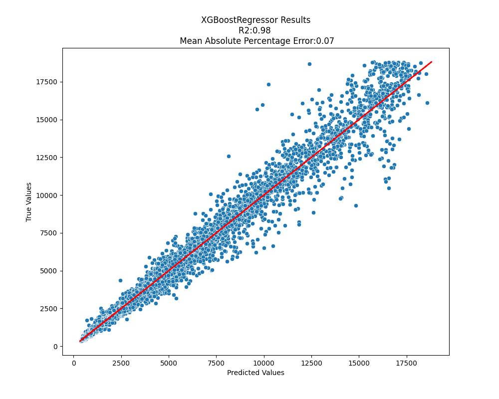
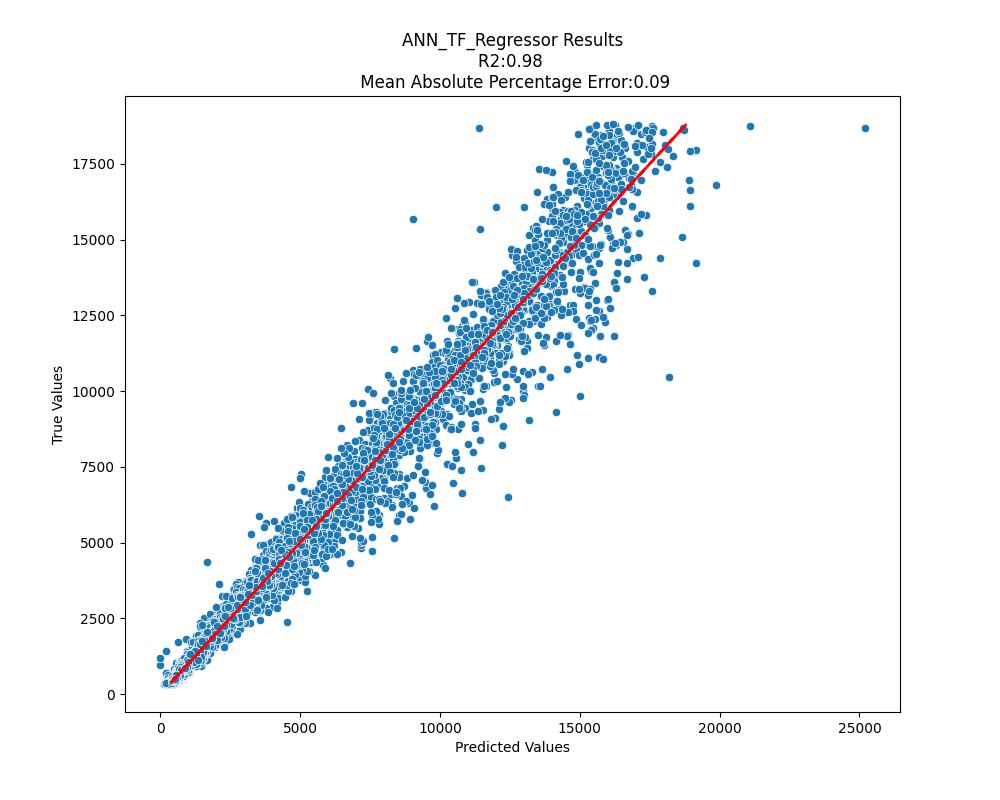
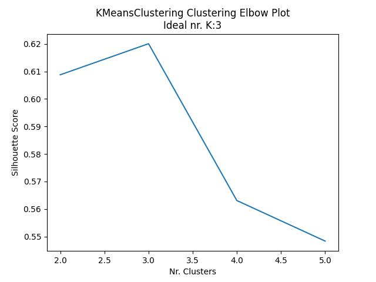
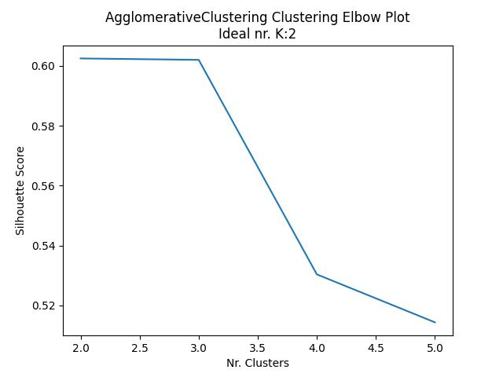
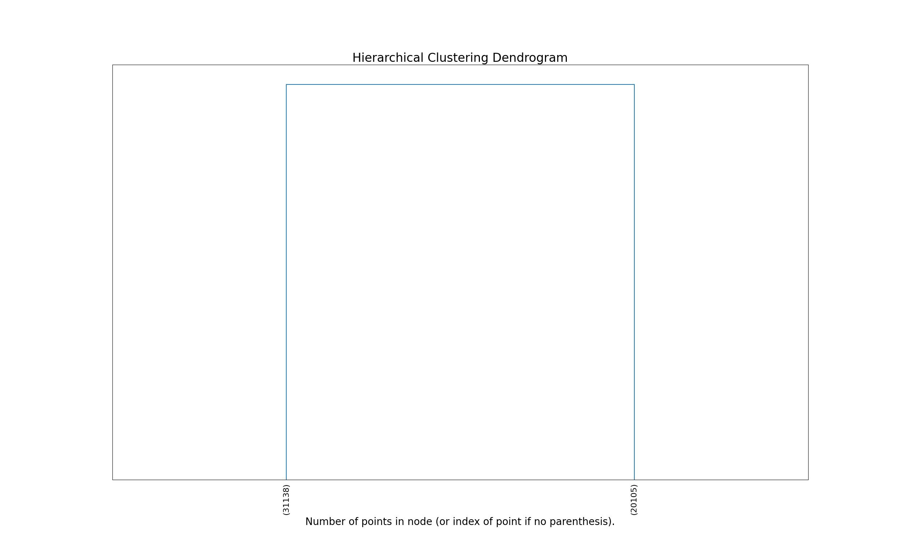

# Machine Learning Framework
# check-code-coverage [![ci status][ci image]][ci url] 


This Python library facilitates the steps needed for the training and testing of machine-learning models dealing with structured data. The framework provides methods for data analysis, classification regression and clustering.

## Package Description:
<br />


<br /><br /><br /><br />

## Installation

The library was developed using [poetry](https://python-poetry.org/) for dependency, environment and package management. A wheel file can be generated with the command:
```bash
poetry build
```

The wheel file itself can be used to install the library using [pip](https://pip.pypa.io/en/stable/):
```bash
pip install path_to_wheelfile/ml_framework-0.1.0-py3-none-any.whl
```

<br /><br /><br />

## Usage

### 1.Data Analysis
```python
import ml_framework

# Analyzer
target_col_name = "target"
analyzer = ClassificationEDA(data_filepath)
analyzer.read_data()
analyzer.clean_data()
analyzer.encode_data(target_col_name=target_col_name)
analyzer.visualize_data(target_col_name=target_col_name)
train_data, valid_data, test_data = analyzer.sample_data(
  target_col_name=target_col_name, train_perc=0.8, valid_perc=0.2
)
```

<br />

#### Data Description Output:


#### Description of Categorical Features:


#### Pair-plot showing the distribution of numerical-feature pairs:


#### Heatmap showing the correlation between features:


#### Histogramm showing the distribution of numerical-features:


#### Histogramm showing the distribution of categorical-features:


#### Boxplots showing the distribution of a given feature across target classes:


#### Stratified Sampling to form the Train, Validation and Test Sets:
Training Set

Validation Set

Test Set


#### Example of output for the data analysis methods:
```console
Data Description:
    ColumnNr  ColumnName               ColumnType  NrNaNs  NrNulls
0          0  Unnamed: 0    <class 'numpy.int64'>       0        0
1          1       carat  <class 'numpy.float64'>       0        0
2          2         cut            <class 'str'>       0        0
3          3       color            <class 'str'>       0        0
4          4     clarity            <class 'str'>       0        0
5          5       depth  <class 'numpy.float64'>       0        0
6          6       table  <class 'numpy.float64'>       0        0
7          7       price    <class 'numpy.int64'>       0        0
8          8           x  <class 'numpy.float64'>       0        0
9          9           y  <class 'numpy.float64'>       0        0
10        10           z  <class 'numpy.float64'>       0        0
Drop columns:  Index(['Unnamed: 0'], dtype='object')

Column Name: cut
Column Number: 1
Categories:
['Fair', 'Good', 'Ideal', 'Premium', 'Very Good']


Column Name: color
Column Number: 2
Categories:
['D', 'E', 'F', 'G', 'H', 'I', 'J']


Column Name: clarity
Column Number: 3
Categories:
['I1', 'IF', 'SI1', 'SI2', 'VS1', 'VS2', 'VVS1', 'VVS2']
```

<br /><br /><br /><br />

### 2.Development of Classifiers
```python
# Classifier
import ml_framework

classifiers_ls = [
    "LogisticRegressionClassifier",
    "KNN_Classifier",
    "DecisionTreeClassifier",
    "RandomForestClassifier",
    "XGBoostClassifier",
    "ANN_TF_Classifier",
    "SupportVectorClassifier",
]

classifiers_performance = defaultdict(list)
for classifier_name in classifiers_ls:
    classifier = eval(classifier_name + "(target_col_name, train_data, valid_data)")
    classifier.fit(nr_iterations=100)
    classifier.predict(test_data)
    score_dict = classifier.score()
    classifier.plot_confusion_matrix()

    classifiers_performance["Model"].append(classifier_name)
    for k, v in score_dict.items():
        classifiers_performance[k].append(v)
```

<br />

#### Example of output for the classification methods:

#### Classification Confusion Matrix:

<br /><br />

#### Performance metrics for all classifiers:
```console
                          Model  Precision    Recall  Accuracy  F1-Score
0  LogisticRegressionClassifier   0.636091  0.520693  0.651469  0.541070
1                KNN_Classifier   0.684462  0.637773  0.686313  0.654432
2        DecisionTreeClassifier   0.693999  0.645946  0.717820  0.655758
3        RandomForestClassifier   0.801956  0.759292  0.779817  0.769552
4             XGBoostClassifier   0.819495  0.793395  0.810861  0.805071
5             ANN_TF_Classifier   0.806076  0.777483  0.800297  0.790336
6       SupportVectorClassifier   0.782612  0.747490  0.780743  0.762896
```

<br /><br /><br /><br />

### 3.Development of Regressors
```python
# Regression
regressors_ls = [
    "LinearRegressor",
    "KNN_Regressor",
    "DecisionTreeRegressor",
    "RandomForestRegressor",
    "XGBoostRegressor",
    "ANN_TF_Regressor",
    "SupportVectorRegressor",
]

regressors_performance = defaultdict(list)
for regressor_name in regressors_ls:
    regressor = eval(regressor_name + "(target_col_name, train_data, valid_data)")
    regressor.fit(nr_iterations=100)
    regressor.predict(test_data)
    score_dict = regressor.score()
    regressor.plot_scatterplot()

    regressors_performance["Model"].append(regressor_name)
    for k, v in score_dict.items():
        regressors_performance[k].append(v)
```

<br />

#### Example of output for the regression methods:
```console
                    Model  R2_Score  Mean_Squared_Error  Root_Mean_Squared_Error  Mean_Absolute_Error  Mean_Absolute_Percentage_Error
0         LinearRegressor  0.908591        1.404287e+06              1185.026250           796.390373                        0.442653
1           KNN_Regressor  0.956235        6.723409e+05               819.963933           391.774657                        0.110497
2   DecisionTreeRegressor  0.955435        6.846317e+05               827.424764           439.768585                        0.120691
3   RandomForestRegressor  0.981591        2.828040e+05               531.793147           270.126756                        0.070488
4        XGBoostRegressor  0.982977        2.615119e+05               511.382309           263.932371                        0.070356
5        ANN_TF_Regressor  0.978419        3.315374e+05               575.792877           309.422360                        0.094138
6  SupportVectorRegressor  0.977465        3.461919e+05               588.380725           339.591720                        0.112032
```

#### Linear Regression:

<br /><br />

#### KNN Regression:

<br /><br />

#### Decision Tree Regression:

<br /><br />

#### Random Forest Regression:

<br /><br />

#### XGBoost Regression:

<br /><br />

#### Artificial Neural Network Regression:


<br /><br />

#### Suport Vector Machine Regression:

<br /><br /><br /><br />

### 4.Development of Clustering Models
```python
# Clustering
clusterings_ls = [
    "KMeansClustering",
    "AgglomerativeClustering",
    "MeanShiftClustering",
    "DBSCAN_Clustering",
]

clustering_performance = defaultdict(list)
for clustering_name in clusterings_ls:
    clustering = eval(clustering_name + "(train_data=train_data)")
    clustering.fit(nr_iterations=100)
    clustering.predict(test_data)
    score_dict = clustering.score()

    clustering_performance["Model"].append(clustering_name)
    for k, v in score_dict.items():
        clustering_performance[k].append(v)
    clustering_performance["NrClusters"].append(clustering.get_num_clusters())
```

<br />

#### Example of output for the clustering methods:
#### K-Means Clustering:
```console
****************************************************************

Running  KMeansClustering

KMeansClustering
Performance Metrics
Silhouette_Coefficient: 0.6200733351348301
Cluster: 0, Size%: 57.96
Cluster: 1, Size%: 31.11
Cluster: 2, Size%: 10.94
```

<br /><br />

#### Agglomerative Clustering:
```console
****************************************************************

Running  AgglomerativeClustering

AgglomerativeClustering
Performance Metrics
Silhouette_Coefficient: 0.6024892950496797
Cluster: 1, Size%: 60.77
Cluster: 2, Size%: 39.23
```


<br /><br />

#### Mean-Shift Clustering:
```console
****************************************************************

Running  MeanShiftClustering

MeanShiftClustering
Performance Metrics
Silhouette_Coefficient: 0.6287381491519984
Cluster: 0, Size%: 86.27
Cluster: 1, Size%: 13.63
Cluster: 2, Size%: 0.01
Cluster: 3, Size%: 0.04
Cluster: 4, Size%: 0.05
Cluster: 5, Size%: 0.00
Cluster: 6, Size%: 0.00
```

<br /><br />

#### DBSCAN Clustering:
```console
****************************************************************

Running  DBSCAN_Clustering

DBSCAN_Clustering
Performance Metrics
Silhouette_Coefficient: 0.6118046690512592
Cluster: -1, Size%: 0.77
Cluster: 0, Size%: 95.69
Cluster: 1, Size%: 3.54

```

<br /><br />

#### Summary of results obtained with the different clustering approaches:
```console
****************************************************************

                     Model  Silhouette_Coefficient  NrClusters
0         KMeansClustering                0.620073           3
1  AgglomerativeClustering                0.602489           2
2      MeanShiftClustering                0.628738           7
3        DBSCAN_Clustering                0.611805           3

```

<br /><br /><br /><br />

## Unit Testing
To run all test you can just run the power shell script run_tests.ps1 or the command 
```
poetry run pytest --cov=ml_framework ./tests
```
#### Unit Testing coverage
```console
============================================================================================= test session starts ==============================================================================================
platform win32 -- Python 3.11.8, pytest-8.0.2, pluggy-1.4.0
rootdir: F:\Weiterbildung\UOC_ML_Bootcamp\Capstone_Projects\ml_framework
plugins: anyio-4.3.0, dash-2.15.0, cov-4.1.0
collected 2 items

tests\test_data_analysis\test_data_cleaning.py ..                                                                                                                                                         [100%]

---------- coverage: platform win32, python 3.11.8-final-0 -----------
Name                                                                Stmts   Miss  Cover
---------------------------------------------------------------------------------------
src\ml_framework\__init__.py                                            0      0   100%
src\ml_framework\data_analysis\__init__.py                              0      0   100%
src\ml_framework\data_analysis\data_cleaning.py                        67     34    49%
src\ml_framework\data_analysis\data_encoding.py                        58     58     0%
src\ml_framework\data_analysis\data_ingestion.py                       44     44     0%
src\ml_framework\data_analysis\data_sampling.py                        94     94     0%
src\ml_framework\data_analysis\data_visualization.py                   96     96     0%
src\ml_framework\data_classification\__init__.py                        0      0   100%
src\ml_framework\data_classification\ann_tf_classifier.py              61     61     0%
src\ml_framework\data_classification\classifier.py                     61     61     0%
src\ml_framework\data_classification\decision_tree_classifier.py       33     33     0%
src\ml_framework\data_classification\knn_classifier.py                 38     38     0%
src\ml_framework\data_classification\logistic_regression.py            34     34     0%
src\ml_framework\data_classification\random_forest_classifier.py       34     34     0%
src\ml_framework\data_classification\run_eda_classification.py         67     67     0%
src\ml_framework\data_classification\support_vector_classifier.py      34     34     0%
src\ml_framework\data_classification\xgboost_classifier.py             34     34     0%
src\ml_framework\data_clustering\__init__.py                            0      0   100%
src\ml_framework\data_clustering\agglomerative_clustering.py           86     86     0%
src\ml_framework\data_clustering\clustering.py                         47     47     0%
src\ml_framework\data_clustering\dbscan_clustering.py                  64     64     0%
src\ml_framework\data_clustering\k_means_clustering.py                 49     49     0%
src\ml_framework\data_clustering\mean_shift_clustering.py              22     22     0%
src\ml_framework\data_clustering\run_eda_clustering.py                 49     49     0%
src\ml_framework\data_input\__init__.py                                 0      0   100%
src\ml_framework\data_regression\__init__.py                            0      0   100%
src\ml_framework\data_regression\ann_tf_regressor.py                   63     63     0%
src\ml_framework\data_regression\decision_tree_regressor.py            31     31     0%
src\ml_framework\data_regression\knn_regressor.py                      36     36     0%
src\ml_framework\data_regression\linear_regression.py                  25     25     0%
src\ml_framework\data_regression\random_forest_regressor.py            32     32     0%
src\ml_framework\data_regression\regressor.py                          58     58     0%
src\ml_framework\data_regression\run_eda_regression.py                 61     61     0%
src\ml_framework\data_regression\support_vector_regressor.py           32     32     0%
src\ml_framework\data_regression\xgboost_regressor.py                  33     33     0%
src\ml_framework\tools\__init__.py                                      0      0   100%
src\ml_framework\tools\helper_functions.py                             15     15     0%
---------------------------------------------------------------------------------------
TOTAL                                                                1458   1425     2%
```
<br /><br /><br /><br />

## Contributing

Pull requests are welcome. For major changes, please open an issue first
to discuss what you would like to change.

Please make sure to update tests as appropriate.

## License

[MIT](https://choosealicense.com/licenses/mit/)
